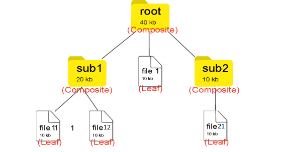

# 반복자 패턴

- 일련의 데이터 집합(List, Array, HashMap, Tree... 등등)에 대해 순차적인 접근(순회)를 지원하는 패턴.
- 배열이나 리스트는 연속적인 데이터라 for문을 통해 순회가능하지만, 해시,트리같이 순서가 정해지지않은 데이터타입은 접근방식이 애매하다. (깊이우선? 너비우선?)
- 그래서 이런 컬렉션 자료구조를 순회하는 전략을 정의하는게 반복자 패턴임.

## 사용시기

- 컬렉션에 상관없이 순회방식을 통일하고자할때
- 컬렉션 순회하는 다양한 방법을 지원하고자할때
- 복잡한 컬렉션의 내부 구조를 캡슐화
- 컬렉션의 종류가 바뀔 가능성이 있을때

## 장점

- 일관된 `Iterator` 인터페이스를 통해 동일한 순회방법을 제공함.
- 컬렉션 내부 구조를 몰라도됨
- 순회 알고리즘을 별도로 분리해서 SRP (단일책임)을 준수
- 컬렉션의 종류가 바뀌어도 구현코드는 변경되지않아 OCP (개방폐쇄)를 준수

## 단점

- class가 늘어나 복잡함

# 컴포지트 패턴

- 복합객체(Composite)와 단일객체(Leaf)를 동일한 컴포넌트로 취급하여 클라이언트에게 이 둘을 구분하지않고 동일한 인터페이스를 사용하도록 하는 패턴.
- 전체-부분의 관계를 갖는 트리 계층 구조를 정의할때 유용함

